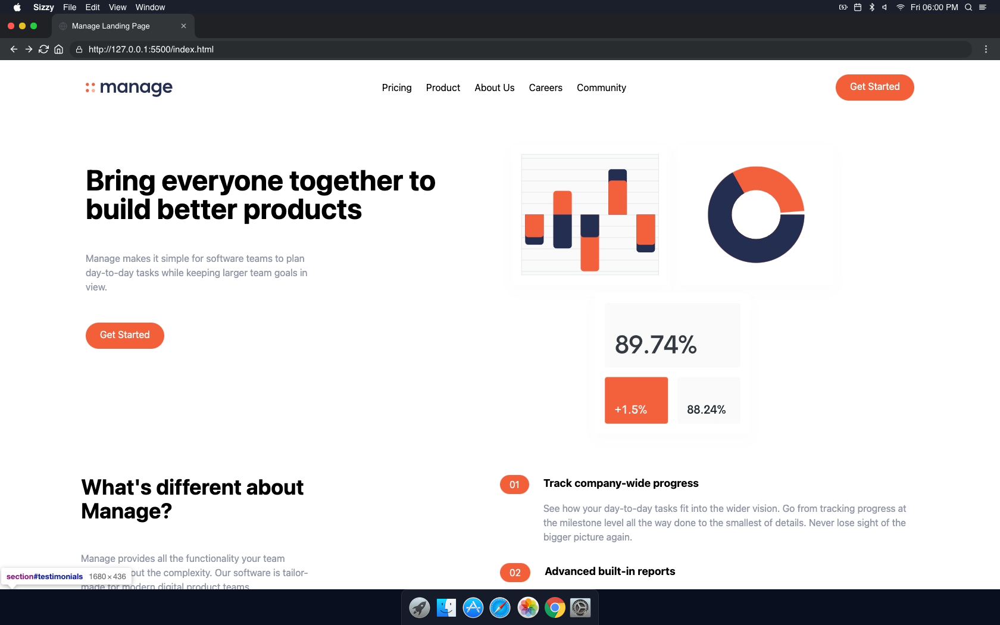

<!-- PROJECT LOGO -->
 

  

  <h3 align="center">Manage Landing Page - Tailwind Project</h3>

  

    An awesome manage landing page that brings everyone together to build better products!
     
    <a href="https://github.com/othneildrew/Best-README-Template"><strong>Explore the docs »</strong></a>
     
     
    <a href="https://anthonys1760.github.io/tailwind-project/">View Demo</a>
    ·
    <a href="https://github.com/othneildrew/Best-README-Template/issues">Report Bug</a>
    ·
    <a href="https://github.com/othneildrew/Best-README-Template/issues">Request Feature</a>
  

<!-- ABOUT THE PROJECT -->
## About The Project

There are many great README templates available on GitHub; however, I didn't find one that really suited my needs so I created this enhanced one. I want to create a README template so amazing that it'll be the last one you ever need -- I think this is it.

Here's why:
* Your time should be focused on creating something amazing. A project that solves a problem and helps others
* You shouldn't be doing the same tasks over and over like creating a README from scratch
* You should implement DRY principles to the rest of your life :smile:

Of course, no one template will serve all projects since your needs may be different. So I'll be adding more in the near future. You may also suggest changes by forking this repo and creating a pull request or opening an issue. Thanks to all the people have contributed to expanding this template!
### Built With:

* [HTML](https://nextjs.org/)
* [CSS](https://reactjs.org/)
* [JavaScript](https://vuejs.org/)
* [Tailwind CSS](https://angular.io/)

(<a href="#top">back to top</a>)
