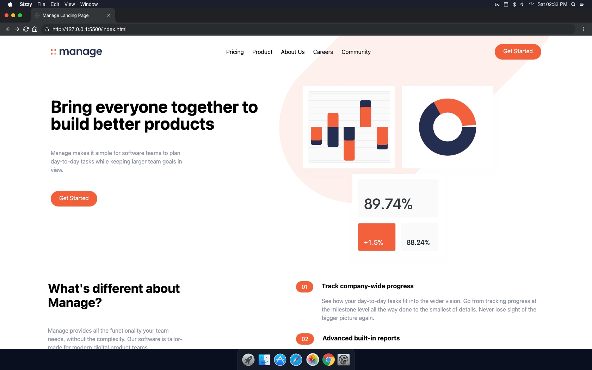

<!-- PROJECT LOGO -->
 

  

  <h3 align="center">Manage Landing Page - Tailwind Project</h3>

  

    An awesome manage landing page that brings everyone together to build better products!
     
    <a href="https://github.com/othneildrew/Best-README-Template"><strong>Explore the docs »</strong></a>
     
     
    <a href="https://anthonys1760.github.io/tailwind-project/">View Demo</a>
    ·
    <a href="https://github.com/othneildrew/Best-README-Template/issues">Report Bug</a>
    ·
    <a href="https://github.com/othneildrew/Best-README-Template/issues">Request Feature</a>
  

<!-- ABOUT THE PROJECT -->
## About The Project

Bring everyone together to build better products
### Built With:

* [HTML](https://nextjs.org/)
* [CSS](https://reactjs.org/)
* [JavaScript](https://vuejs.org/)
* [Tailwind CSS](https://angular.io/)

(<a href="#top">back to top</a>)
